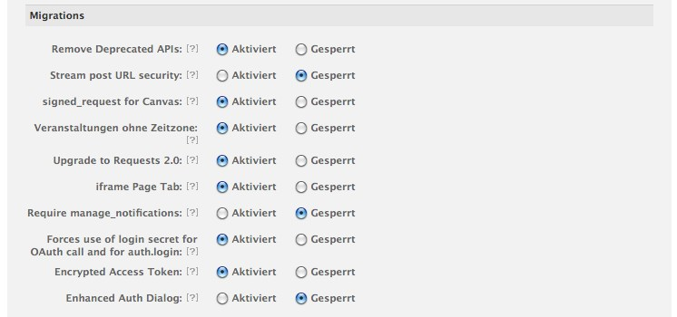

.. _installation:

============
Installation
============

Add ``'facebook'`` to your ``INSTALLED_APPS``
---------------------------------------------

The app has a lot of models. To only create the tables you need you have to add
the models that you want separately.
Here is an example::

    INSTALLED_APPS = (
        ...
        'facebook',
        'facebook.modules.profile.page',
        'facebook.modules.profile.user',
        'facebook.modules.profile.event',
        'facebook.modules.profile.application',
        'facebook.modules.connections.post',
        ...
    )

Add the middlewares
-------------------

The ``SignedRequestMiddleware`` is the main middleware that stores the signed
request in a special session object and allows your app to access it. Most
of the framework expects this middleware to be installed to function correctly.

Because Facebook calls your page initially with POST, you need a custom csrf middleware
that lets facebook pass.

The ``AppRequestMiddleware`` adds some tools to help dealing with app requests::

    MIDDLEWARE_CLASSES = (
        'facebook.csrf.CsrfViewMiddleware',
        <other middlewares>,
        'facebook.middleware.SignedRequestMiddleware',
        'facebook.middleware.AppRequestMiddleware', # optional.
    )

Add the URLs
------------

The basic URLconf entry adds the channel URL, the deauthorize view and some
debug tools::

    url(r'^facebook/', include('facebook.urls')),

The registration backend URL activates login functionality through Facebook Connect::

    url(r'^accounts/', include('facebook.backends.registration.urls')),

The App Settings Dict
---------------------

This dict stores all the details that facebook provides. You should have an
entry for every app in your project. It is recommended to use different app
(and therefore a different version of this dict) for local development::

    FACEBOOK_APPS = {
        'name' : {
                'ID': '?????????',
                'SECRET': '?????????',
                'CANVAS-PAGE': 'https://apps.facebook.com/yourapp',
                'CANVAS-URL': '',
                'SECURE-CANVAS-URL': '',
                'REDIRECT-URL': 'mydomain.com/facebook/redirect/?next=%2F%2Fwww.facebook.com%2Fpages%2F',
                'DOMAIN' : 'localhost.local:8000',
                'NAMESPACE': 'mynamespace',
        }
    }

The Facebook Javascript SDK
---------------------------

For any client side Facebook integration you need the Javascript SDK.

Add the fb namespace to the ``<html>`` tag::

    <html xmlns="http://www.w3.org/1999/xhtml" xmlns:fb="https://www.facebook.com/2008/fbml">

Add this to the header section of your base template::

    
    
    

Or this if you use the FeinCMS page extension to discern between different
Facebook applications in one installation::

    
    
    

Add this to the bottom of your base template in the scripts section::

    

    

The Facebook script is loaded asynchronously. Therefore you have to use the FQ,
a simple script queue for inline javascript code that needs the Facebook
object. The FQ is run when the SDK has been loaded and the user login status
determined. Adding code which is run as soon as the Facebook API is ready is
simple::

    FQ.add(function() {
        // your code here
    });

Create a Facebook App
---------------------
Create a new Facebook app on https://developers.facebook.com/apps. You need to
have a verified Facebook account. If you don't, Facebook will ask you to verify
your account. ``django-facebook-graph`` uses OAuth 2.0. Activate it in your app
settings:

Local Facebook development
--------------------------

If you want to develop locally, follow these steps:

* Create a separate app and set http://localhost.local:8000/  as site URL.
* Map localhost.local to 127.0.0.1 in your ``/etc/hosts`` file (``/private/etc/hosts`` on OS X)

Now you can open your app on Facebook and it will load the data from your
runserver. On Firefox you can even chose 'Open Frame in new tab' for quicker
page reloads, once you've opened the page in Facebook and the cookie is set.

For Facebook connect, make sure you use the URL localhost.local:8000 and
not localhost:8000. This will not work. Facebook enforces the Site URL.

Facebook Connect support for your website
-----------------------------------------

The Facebook Connect support consists of two parts: A backend for
django-registration_ which creates users and an authentication
backend which is responsible for the actual login on a Django website.

.. _django-registration: https://bitbucket.org/ubernostrum/django-registration

Setting the authentication backend
**********************************

We want to handle logins with the default backend first and fall back to
the Facebook authentication backend if the default backend couldn't handle
the login request::

    AUTHENTICATION_BACKENDS = (
        'django.contrib.auth.backends.ModelBackend',
        'facebook.backends.authentication.AuthenticationBackend',
    )

Currently ``django-facebook-graph`` only supports Facebook Connect with the
Login Button. The Registration Widget is not supported.
